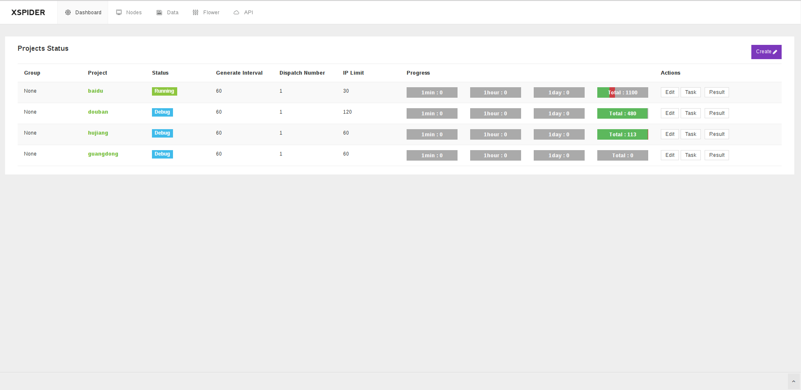
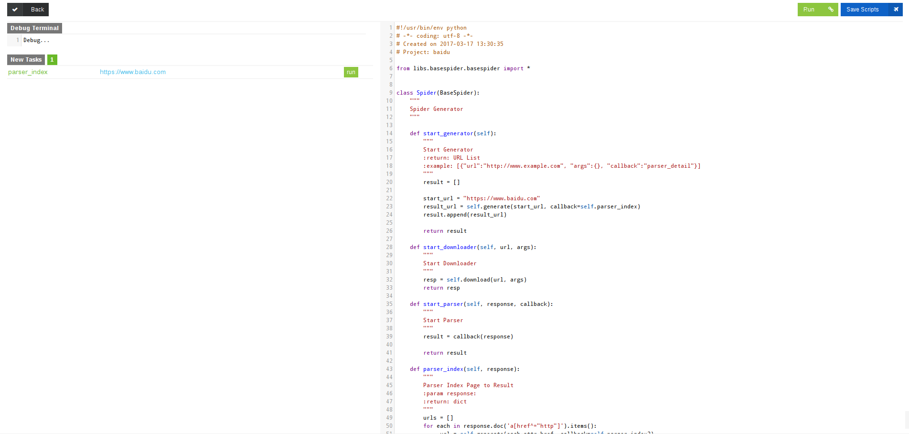
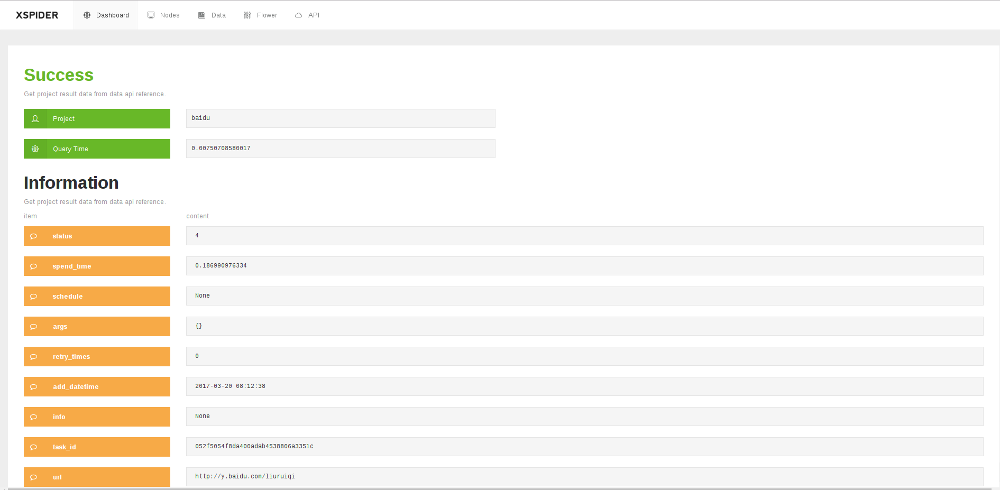
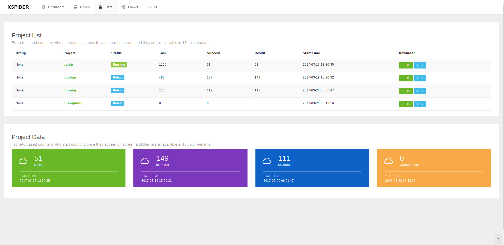

# Xspider
> A Distributed web crawler system. Support for templated spider development.

- Some features refer to Pyspider and Scrapy, including WebUI with script editor, task monitor, project manager and result viewer.
- Using IP nodes for distributed node management, using Celery as a distributed task queue.
- Support nodes task scheduling, including the configuration of single spider frequency and network requests and other parameters.
- Support the configuration of project priority, task retry-times.

### Web dashboard


### script editor  


### task log


### data


### Installation

1. Install Python 2.7
```bash
$ brew install python
```

2. Install MongoDB & Redis

3. Clone Xspider Code
```bash
git clone https://github.com/zym1115718204/xspider.git
```

4. Install Package
```bash
$ pip install -r requirements.txt
```

5. Run
```bash
$ cd xspider/xspider
$ python manage.py run all
```

6. Visit: http://localhost:2017


### Todo

- [ ] Nodes Management

### License

Licensed under the Apache License, Version 2.0